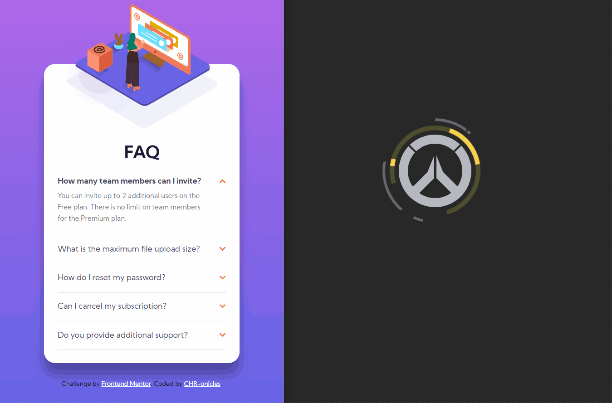

# Frontend Mentor - FAQ accordion card solution

This is a solution to the [FAQ accordion card challenge on Frontend Mentor](https://www.frontendmentor.io/challenges/faq-accordion-card-XlyjD0Oam). Frontend Mentor challenges help you improve your coding skills by building realistic projects. 

## Table of contents

- [Overview](#overview)
  - [The challenge](#the-challenge)
  - [Screenshot](#screenshot)
  - [Links](#links)
- [My process](#my-process)
  - [Built with](#built-with)
  - [What I learned](#what-i-learned)
- [Author](#author)

## Overview

### The challenge

Users should be able to:

- View the optimal layout for the component depending on their device's screen size
- See hover states for all interactive elements on the page
- Hide/Show the answer to a question when the question is clicked

### Screenshot

### Links

- Solution URL: [My solution](https://github.com/CHR-onicles/FEM-FAQ-accordion-card)
- Live Site URL: [Live site](http://faq-accordion-card-two-lake.vercel.app)

## My process

### Built with

- Semantic HTML5 markup
- CSS
- Javascript

### What I learned

Just a refresher on flexboxes.

## Author

- Website - [CHR-onicles](https://github.com/CHR-onicles)
- Frontend Mentor - [@CHR-onicles](https://www.frontendmentor.io/profile/CHR-onicles)
